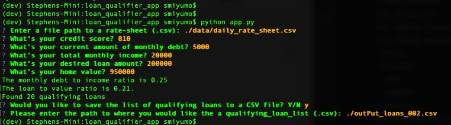

# loan_qualifier_repo
This is a repository for loan qualifier application

# Loan Qualifier Application: new save csv feature option

Loan Qualifier Application is a fintech lending software used to match customers with loans that they qualify for from differnt institutions. 

The current project is to enhance the application with a new feature that will prompt the user to save the qualifying loans to a new CSV file.

---

## Technologies

This project leverages python 3.7 with the following packages:
*[fire](https://github.com/google/python-fire) - For the command line interface, help page, and entry-point.

* [questionary](https://github.com/tmbo/questionary) - For interactive user prompts and dialogs

---

## Installation Guide

Before running the application first install the following dependencies.

```python
  pip install fire
  pip install questionary
```
run the commands as shown on the terminal in the image below.


---

## Usage

To use the loan qualifier application simply clone the repository and run the **app.py** with the:

```python
python app.py 
```

---

## Contributors

Brought to you by odhissm@gmail.com

---

## License

MIT